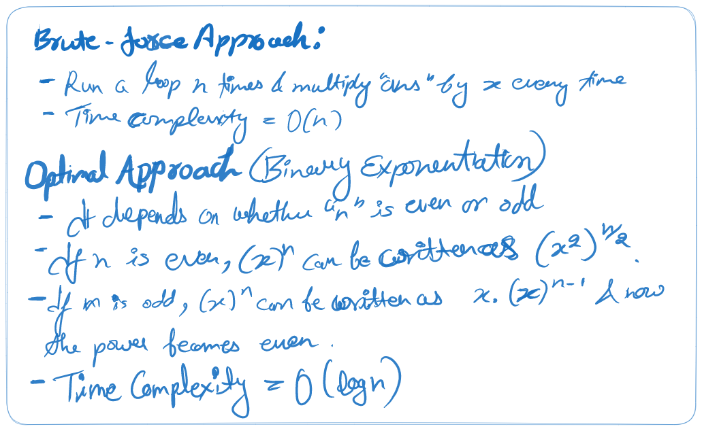
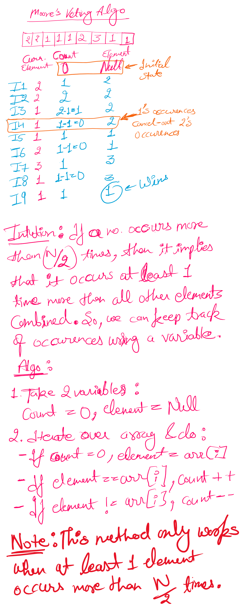

# Table of Contents
[1. Count inversions in an array](https://github.com/KEHSIHBA-IGAYT/compCoding/edit/main/Arrays/Arrays.md#1--count-inversions-in-an-array)<br>
[2. Implement Pow(x,n)](https://github.com/KEHSIHBA-IGAYT/compCoding/blob/main/Arrays/Arrays.md#2--implement-powxn) 

# 1.  Count inversions in an array
**Problem Statement:** Given an array of N integers, count the inversion of the array.

Inversions in an array: You have to find pairs (A[i],A[j])  where  i < j and A[j] < A[i].

**Example 1:**
**Input Format**: N = 5, array[] = {1,2,3,4,5}
**Result**: 0
**Explanation**: we have a sorted array and the sorted array has 0 inversions as for i < j you will never find a pair such that A[j] < A[i]. More clear example: 2 has index 1 and 5 has index 4 now 1 < 5 but 2 < 5 so this is not an inversion.

**Example 2:**
**Input Format**: N = 5, array[] = {5,3,2,1,4}
**Result**: 7
**Explanation**: There are 7 pairs (5,1), (5,3), (5,2), (5,4),(3,2), (3,1), (2,1) and we have left 2 pairs (2,4) and (1,4) as both are not satisfy our condition.


**Solution**:

Brute force approach:
- Compare every element with all the subsequent elements and keep increasing the count if found such a pair (a[i] > a[j] for i < j).
- Time complexity: O(n^2)

Optimal approach:
- Intuition to remember: If there are 2 sorted subarrays {2,3,5} & {1,4} (example 2), we can take 2 pointers i & j, "i" pointing to 1st element of arr1 and "j" pointing to 1st element of arr2.
- Since both arrays are sorted, we can infer that if arr1[i] > arr2[j] then all elements subsequent to arr1[i] will be bigger than arr2[j] and hence we do not need to compare those elements individually with arr2[j]. (We can increase the count by **n1-i** here & then move j by 1)
- If arr1[i] <= arr2[j], then we move "i" by 1 without incrementing the count.
  ```
  {2,3,5}                {1,4}
   i                      j
  arr1[i] > arr2[j] ====> cnt = cnt + 3; j++;
   
  {2,3,5}                {1,4}
   i                        j
  arr1[i] < arr2[j] ====>  i++;
    
  {2,3,5}                {1,4}
     i                      j
  arr1[i] < arr2[j] ====>  i++;
    
  {2,3,5}                {1,4}
       i                    j
  arr1[i] > arr2[j] ====> cnt = cnt + 1; i++;
  ```

  - This looks like something which can easily be achieved by breaking the arrays into subarrays and sort them (Ummmm, sounds similar to "Merge Sort").
  - In the "Merge" function of merge sort, where we compare the elements from 2 subarrays using left & right pointers, we can simply increment our "count" variable by (mid - left + 1).
```
private static int merge(int[] arr, int low, int mid, int high) {
        ArrayList<Integer> temp = new ArrayList<>();
        int cnt = 0;
        int left = low;
        int right = mid + 1; 
        while (left <= mid && right <= high) {
            if (arr[left] <= arr[right]) {
                temp.add(arr[left]);
                left++;
            } else {
                temp.add(arr[right]);
                //HERE WE ADD OUR CODE TO INCREMENT THE COUNTER
                cnt = cnt + (mid - left + 1);
                right++;
            }
        }
        
        while (left <= mid) {
            temp.add(arr[left]);
            left++;
        }
        while (right <= high) {
            temp.add(arr[right]);
            right++;
        }
        for (int i = low; i <= high; i++) {
            arr[i] = temp.get(i - low);
        }

     return cnt;
    }
```
# 2.  Implement Pow(x,n)
**Problem Statement:** Given a double x and integer n, calculate x raised to power n. Basically Implement pow(x, n).

**Example 1:**
**Input:** x = 2.00000, n = 10
**Output:** 1024.00000

**Explanation:** You need to calculate 2.00000 raised to 10 which gives ans 1024.00000

**Solution:**



```
public static double pow(x, n) {
// n can be negative so store n and take out mod
int nn = n;
if(nn < 0) nn = -1 * nn;
double ans = 1;
while(nn > 0) {
	if(nn%2 == 0) {
		x = x*x;
		n = n/2;
	}
	else {
		ans = ans * x;
		n = n - 1;
	}
}
if(n < 0) ans = (double) (1.0) / (double) (ans);
return ans;
}
```

# 3. Find the Majority Element that occurs more than N/2 times
**Problem Statement:** Given an array of **N integers**, write a program to return an element that occurs more than **N/2** times in the given array. You may consider that such an element always exists in the array.

**Example 1:**
**Input Format:**  N = 7, nums[] = {2,2,1,1,1,2,2}
**Result**: 2
**Explanation**: After counting the number of times each element appears and comparing it with half of array size, we get 2 as result.

**Solution:**

One solution is to use a hashmap where element of the arrays would be the key of the hashmap and it's frequency/occurrence would be the value against that key. Since accessing and writing to a hashmap is of order O(1), the total time complexity would be O(n).
But we are consuming extra O(n) space for hashmap.

A better approach is to use Moore's Voting Algorithm.

**Code:**
```
var majorityElement = function(nums) {
    //Moore's Voting Algorithm
    let cnt = 0;
    let result;

    for(let ele of nums) {
        if(cnt === 0 ) {
            result = ele;
            cnt++;
        }
        else if(ele === result) {
            cnt ++;
        }
        else {
            cnt--;
        }
    }
    return result;
};
```